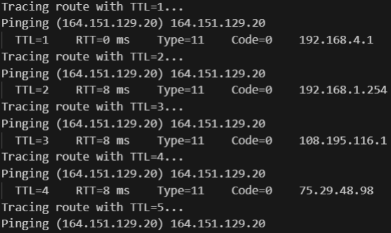
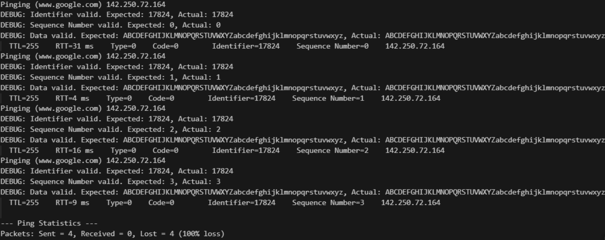

# Ping Trace

Ping Trace is a network diagnostic tool written in Python that builds upon a raw socket ICMP ping implementation to provide traceroute functionality. It sends ICMP echo requests with incrementing TTL values to trace the route from the source to a target host. Intermediate routers reply with ICMP Time Exceeded messages, while the destination responds with an ICMP Echo Reply. The tool validates responses and aggregates statistics such as round-trip times and packet loss.

## Features

- **Combined Ping and Traceroute:** Utilizes raw socket programming to send ICMP echo requests and perform traceroute.
- **Incremental TTL:** Discovers each hop along the network path by incrementing the Time to Live (TTL) value.
- **Response Validation:** Checks packet identifiers, sequence numbers, and embedded data to ensure valid responses.
- **Statistics Reporting:** Aggregates round-trip times (RTT) and calculates packet loss percentage.
- **Error Handling:** Processes error responses (e.g., Destination Unreachable, ICMP type 3) for robust performance.

## Code Structure

- **IcmpHelperLibrary-1.py:**  
  Contains the `IcmpHelperLibrary` class, which encapsulates the logic for:
  - **ICMP Packet Creation:** Building echo request packets.
  - **Checksum Calculation:** Ensuring packet integrity.
  - **Response Handling:** Processing ICMP replies for both ping and traceroute.
  - **Statistics Aggregation:** Reporting individual and aggregated round-trip times.

- **main() Function:**  
  Serves as the entry point where you can select either ping or traceroute functionality by uncommenting the desired function call.

## Requirements

- **Python 3.x**
- **Administrative Privileges:**  
  - **Linux/macOS:** Run with `sudo` to allow raw socket creation.
  - **Windows:** Run as Administrator.
- **Network Access:** Ensure that your system and firewall settings permit ICMP traffic.

## How to Run

1. **Clone the Repository:**

   ```bash
   git clone https://github.com/johnpaulfeliciano98/ping-trace.git
   cd ping-trace
   ```

2. **Run the Program with Elevated Privileges:**

   - **Linux/macOS:**

     ```bash
     sudo python3 IcmpHelperLibrary-1.py
     ```

   - **Windows:**

     Open Command Prompt as Administrator and execute:

     ```bash
     python IcmpHelperLibrary-1.py
     ```

3. **Select Functionality:**

   Edit the `main()` function in `IcmpHelperLibrary-1.py` to uncomment the desired function call for ping or traceroute.

## Screenshots

  
*Output showing an intermediate router response (ICMP Type 11).*

  
*Output showing the destination response (ICMP Echo Reply, Type 0).*

## Contact

For questions or suggestions, please reach out at [johnpaulfeliciano98@gmail.com](mailto:johnpaulfeliciano98@gmail.com).
